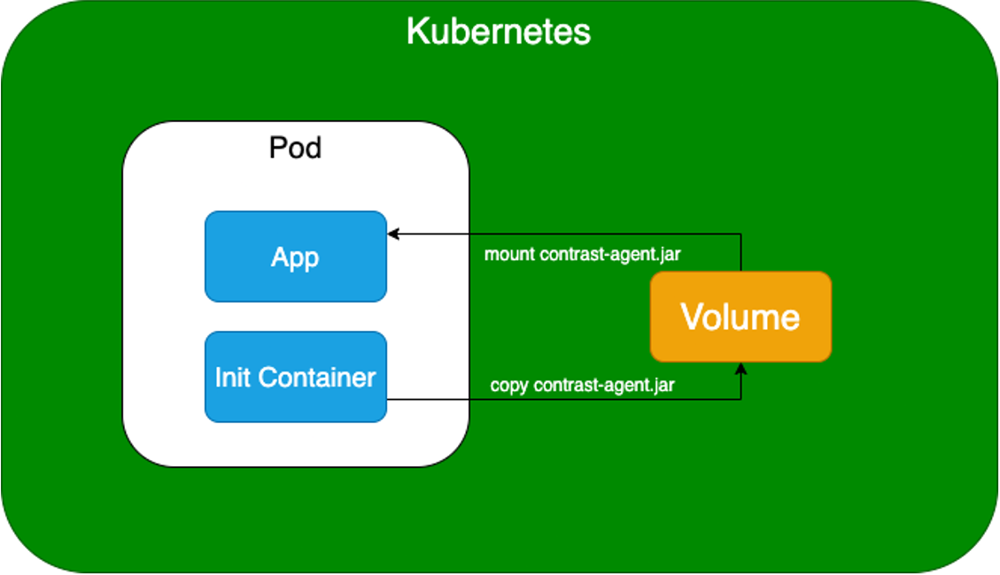

# Java - Init Container Deployment

# Introduction
The Init Container method of deploying the Contrast Java Agent to the WebGoat application. Kustomize is used in this example to apply changes without modifying the original Kubernetes manifests.

# Implementation
An Init Container is a specialized container that run before the app container in the Pod.

For this example, the init container contains the Contrast Java agent. When the Pod starts, the init container is run before the app and does the following before exiting:
1. Mounts a shared volume.
1. Copies the `contrast-agent.jar` file to the shared volume.

When the init container exits, the app container starts and does the following:
1. Mounts the `contrast-agent.jar` from the shared volume containing the agent.
1. Mounts the `contrast_security.yaml` configuration from a Kubernetes Secret.
1. Uses environment variables set within the deployment to specify the location of the agent and the configuration files.



## Kustomize
Kubernetes >= v1.14 ships with Kustomize. Kustomize allows us to patch in the Contrast Java Agent and configuration files without actually modifying the Kubernetes deployment manifest, which is neat.

In the following `kustomization.yaml` example file, we are doing the following:
* Patching in modifications from the `contrast-java-agent.yaml`
* Generating a Kubernetes Secret object from the `contrast_security.yaml` file.
```yaml
apiVersion: kustomize.config.k8s.io/v1beta1
kind: Kustomization

resources:
  - k8s_deployment.yaml
patchesStrategicMerge:
  - contrast-java-agent.yaml
secretGenerator:
  - name: contrast-security
    files:
    - contrast_security.yaml
```

# Running the example

## Building Images
You first need to build the images locally, as these are not currently deployed to an image repository. The following command will build the `contrast/webgoat` application image and the `contrast/java-agent` agent image.
```bash
cd completed
./build_images.sh
```

## Download `contrast_security.yaml` file
After those images are built, you will need to make sure you download a valid `contrast_security.yaml` file into the `completed` folder. This will be used to generate the Kubernetes Secret.

## Deploy using Kustomize
Running the following command will apply using Kustomize, patching in the modifications made within the `contrast-java-agent.yaml` file and generating the secret from `contrast_security.yaml`
```bash
kubectl apply -k .
```

## Delete Deployment
After you are finished, you can run the following command to destroy the created resources:
```bash
kubectl delete -k .
```